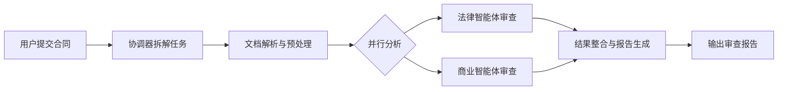

# 合同审查多智能体系统

基于 LangGraph + LangChain 框架的智能化合同审查解决方案，通过多智能体协同工作实现合同全维度自动化分析与风险评估。

## 系统简介

本系统采用分布式智能体架构，将复杂的合同审查任务拆解为专业化子任务，由不同领域的智能体分工协作完成，最终生成结构化审查报告。适用于企业法务、风控、采购等场景，可显著提升合同处理效率（平均提速60%+）并降低人工审查疏漏风险。

核心优势：
- **专业化分工**：各智能体专注特定领域，分析深度远超单一模型
- **流程自动化**：从文档解析到报告生成全流程无需人工干预
- **可追溯性**：完整记录审查过程，支持结果溯源与流程复盘
- **高扩展性**：模块化设计，可快速新增智能体或扩展分析维度

## 核心智能体架构

| 智能体角色 | 核心功能 | 技术特点 |
|------------|----------|----------|
| **协调器（Coordinator）** | 任务拆解、流程调度、结果聚合 | 基于LangGraph构建状态流转逻辑，支持动态工作流 |
| **法律智能体（LegalAgent）** | 条款合规性检查、法律风险识别、权责对等性分析 | 内置合同法条款库，支持风险等级量化评估 |
| **商业智能体（BusinessAgent）** | 价格合理性分析、支付条款评估、履约风险预判 | 融合财务指标模型，识别商业条款潜在陷阱 |
| **整合智能体（IntegrationAgent）** | 多源结果融合、报告结构化生成 | 支持自定义报告模板，满足不同场景输出需求 |

> 注：格式智能体、文档智能体、高亮智能体现阶段已整合至核心流程，不再作为独立服务部署

## 功能特性

### 全方位审查能力
- **法律维度**：合规性校验、权利义务平衡性分析、违约责任合理性评估
- **商业维度**：价格结构分析、支付节奏风险、履约可行性评估
- **结构维度**：条款完整性检查、逻辑连贯性分析、关键信息提取

### 智能工作流


### 标准化输出
审查报告包含以下核心模块：
- 执行摘要（关键发现与风险评级）
- 法律风险清单（含条款定位与依据）
- 商业风险分析（附量化评估指标）
- 优化建议（具体条款修改方案）
- 审查结论（签署风险提示）

## 快速开始

### 环境要求
- Python 3.11+
- 推荐配置：8GB内存以上，Python虚拟环境

### 安装部署

1. 克隆仓库
```bash
git clone https://github.com/yourusername/contract-review-agent-system.git
cd contract-review-agent-system
```

2. 安装依赖
```bash
# 创建虚拟环境（可选但推荐）
python -m venv venv
source venv/bin/activate  # Linux/Mac
# 或 venv\Scripts\activate  # Windows

# 安装依赖包
pip install -r requirements.txt
```

3. 配置系统
```bash
# 复制配置模板并修改
cp config.example.py config.py
# 编辑配置文件，设置API密钥、模型参数等
vim config.py
```

### 启动与使用

```bash
# 启动系统
python start_system.py start

# 查看运行状态
python start_system.py status

# 提交审查任务（示例）
curl -X POST http://localhost:7000/review \
  -H "Content-Type: application/json" \
  -d '{"contract_text": "【合同文本内容】"}'
```

系统启动后，可通过 `http://localhost:7000` 访问Web接口（如需可视化界面，可部署配套前端组件）

## 示例场景

以销售合同审查为例，系统处理流程：
1. 解析合同文本，提取甲乙双方信息、标的条款、支付方式等关键要素
2. 法律智能体识别潜在风险：如违约责任不对等（甲方逾期违约金0.1%/日，乙方逾期未约定）
3. 商业智能体验证：付款节点与交付进度匹配度，发现"50%进度款"缺乏量化验收标准
4. 整合智能体生成报告，针对风险点提供具体修改建议（如补充乙方逾期责任条款、明确进度验收指标）

## 技术栈

- **核心框架**：LangChain（智能体交互）、LangGraph（工作流编排）
- **模型支持**：兼容OpenAI API、DeepSeek、讯飞星火等主流LLM
- **存储层**：内置MemorySaver（状态管理），支持扩展至Redis/MongoDB
- **开发规范**：PEP 8代码规范，完整单元测试覆盖核心模块

## 扩展指南

### 新增智能体
1. 创建新智能体类，继承`BaseAgent`并实现`process_text_message`方法
   ```python
   class NewFunctionAgent(BaseAgent):
       def __init__(self):
           super().__init__("NewFunctionAgent", "系统提示词")
       
       def process_text_message(self, message, context=None):
           # 实现自定义处理逻辑
   ```
2. 在协调器中注册新智能体（`coordinator.py`）
3. 配置工作流节点与连接关系（`_build_workflow_graph`方法）

### 自定义报告模板
修改`integration_agent.py`中的`generate_report`方法，支持：
- 调整报告章节结构
- 新增自定义分析维度
- 适配不同行业合同规范

## 许可证

[MIT](LICENSE)

---

## 常见问题

**Q：系统支持哪些类型的合同审查？**  
A：默认支持销售合同、采购合同、服务协议等常见类型，可通过扩展智能体适配特定行业合同（如劳动合同、工程合同）

**Q：如何提高审查准确率？**  
A：建议在`config.py`中配置更专业的领域模型，并通过`data/training/`目录添加行业合同样本进行微调

**Q：是否支持PDF等格式的合同文件？**  
A：需配合文档解析工具（如pdfplumber）预处理，可在`document_processing`环节扩展文件解析能力